# BabelTower 商业计划书

> 产品定位：Playable AI Dramas for language, culture, expression, and decision-making\
> 当前阶段：以 `The Memory Protocol` 为核心的一部早期 MVP 互动短剧样片验证

***

## 1. 执行摘要

巴别塔（BabelTower）是一款面向高意愿外语表达用户的 AI 互动短剧学习产品。它让用户进入有角色、有冲突、有选择、有语音回应和多结局的短剧，在剧情压力下练习表达观点、解释风险、提出条件和说服他人，并在结局后通过成就、复盘和跟读完成学习闭环。

当前项目已经完成一部核心样片 **The Memory Protocol** 的可运行原型：它是一部科幻伦理互动英语短剧，单次体验约 10-12 分钟，由 18 个核心剧情 / 视频段落拆分为 35 个可追踪运行时节点，包含 8 个互动点、6 个结局、8 个成就和 145 条跟读复盘台词。用户在前半段通过剧情选择建立立场，在后半段通过语音表达、见证记录和最终治理决策影响结局。

| 投资人第一屏信息 | 当前口径                                             |
| -------- | ------------------------------------------------ |
| 我们是谁     | AI 互动短剧英语表达训练产品                                  |
| 为谁做      | 高中生、大学生、雅思/托福学习者、小语种学习者、有真外语实表达压力的用户             |
| 做到哪里     | 已跑通 The Memory Protocol 样片：选择、语音、状态机、多结局、成就和跟读复盘 |
| 本轮融资     | 天使轮，目标 300 万—500 万元人民币                           |
| 这笔钱验证什么  | 真实用户是否愿意完播、开口、复刷，并为下一部或更深复盘付费                    |

核心假设是：一部分高意愿英语学习者并不缺少学习工具，而是缺少低压力、强情境、可复盘的表达训练入口。传统语言学习产品以课程和练习为主，短剧产品擅长吸引注意力但缺少主动参与，开放式 AI 角色聊天互动强但难以保证剧情边界和学习结果。BabelTower 的切入点是把短剧、互动和表达反馈组合成一个可验证的学习体验。

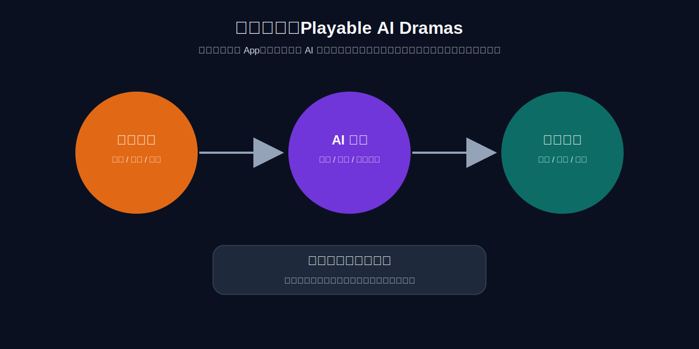

当前材料不把 BabelTower 描述为已经成型的内容平台，而是聚焦一部样片的真实验证：The Memory Protocol 是否能让用户完播、开口、复刷，并在结局后使用复盘和跟读功能。后续内容系列化和商业化路径，均以这组用户行为数据为前提。

外部条件正在改善。短剧市场验证了移动端剧情消费和小额付费习惯；Duolingo、Speak 等产品验证了语言学习和 AI 口语训练需求；AI 角色扮演和企业模拟训练说明“情境演练”正在被教育和培训场景接受；生成式视频、ASR 和低成本 LLM 则降低了小团队制作互动样片的门槛。BabelTower 需要验证的是：这些能力组合后，能否形成可留存、可复刷、可付费的英语表达训练产品。

***

## 2. 产品概述：从剧情入口切入表达训练

BabelTower 的产品形态是移动端互动英语短剧。用户不是先进入课程目录，而是先进入一个有身份、有冲突、有角色关系的剧情场景，在关键节点通过选择和语音表达推动剧情。

在一个 BabelTower 短剧里，用户会被赋予明确身份，例如外部伦理观察员、海外面试候选人、跨国会议协调者或客户沟通负责人。剧情会设置一个需要表达的任务：解释风险、澄清事实、提出条件、调停冲突或说服角色。系统根据用户的选择和语音回应更新变量、触发结局，并在结局后给出成就、复盘和跟读材料。

产品设计顺序是：先用剧情降低学习压力，再用角色关系提高代入感，最后在关键节点触发表达任务。结局后，系统再把用户刚才使用到的表达能力显性化，包括观点是否清楚、理由是否充分、表达是否自然，以及哪些台词适合跟读复习。

这一设计的目标不是把课程包装成短剧，而是把语言练习放回有身份、利益、误解、风险和后果的表达场景。早期验证重点是确认这种剧情压力是否能提高用户开口率、完播率和复刷率。

***

## 3. 问题与机会：三个成熟市场之间的空白

BabelTower 的机会来自三个相邻市场之间的交叉点。语言学习、短剧内容和 AI 角色互动都已有强玩家，分别验证了学习需求、剧情消费和虚拟角色互动。尚待验证的空间是：能否把三者组合成一个用户愿意开始、愿意参与、能够复盘、并愿意再次进入的学习产品。

语言学习产品证明了需求强度。Duolingo 的公开业绩显示，公司已经拥有超过 5,000 万 DAU，全年 bookings 超过 10 亿美元，并持续强调人工智能对学习方式的改变。[^duolingo2025] Speak 的融资公告也说明市场正在押注人工智能口语：Speak 在 2024 年完成 7,800 万美元 C 轮融资，估值达到 10 亿美元，累计融资 1.62 亿美元，用户已经说出超过 10 亿句。[^speakseriesc] 这些事实说明，语言学习不是小市场，人工智能口语训练也不是边缘需求。

但语言学习产品长期面对一个心理阻力：很多用户打开它，是因为“我应该学习”，而不是“我想知道接下来发生什么”。这会让产品依赖提醒、自律、打卡和目标压力。即使产品加入游戏化和 AI 角色，底层体验仍然容易被用户理解成练习。对这类用户而言，新的机会不只是增加练习入口，而是降低练习感，并把表达任务嵌入更自然的叙事情境。

短剧产品解决了开始的问题。移动短剧已经证明，用户愿意在碎片时间追剧情、等待反转、付费解锁后续内容。Sensor Tower 和相关媒体资料显示，短剧 App 在移动端持续保持很强的增长和变现能力。[^sensortower][^marketingdive] 但短剧的问题是用户仍然只是观众。它让剧情消费变得更高频，却没有让用户成为故事中的行动者。

人工智能角色聊天和互动故事产品则证明了用户愿意与虚拟角色互动。StoryZone 等产品强调人工智能互动故事、角色扮演和多题材互动故事。[^storyzone] 但开放式人工智能聊天也有天然问题：越自由越容易散，越像聊天越难保证剧情节奏，越依赖模型即时生成越难保证结局质量、学习目标和复盘结果。教育和训练场景尤其需要边界，因为用户需要的不是无限聊天，而是在一个具体情境中完成表达、判断和反馈。

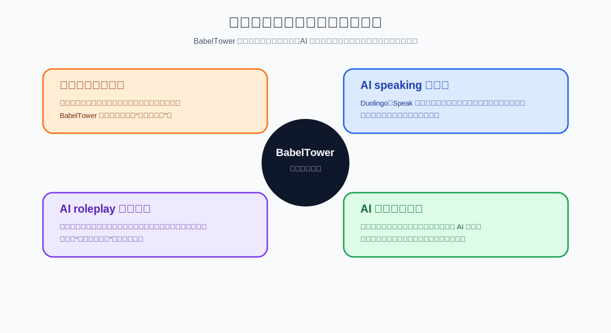

BabelTower 的早期定位是这三类产品之间的垂直切口：使用短剧降低进入门槛，使用有边界的 AI 交互提高参与度，使用复盘和跟读保留学习价值。它不是要替代完整课程体系，而是先验证“故事化表达训练”能否成为一个独立、高频、可付费的使用场景。

***

## 4. 解决方案：多结局、可交互、可对话的短剧学习体验

巴别塔的解决方案不是“视频 + 题目”，而是一套围绕互动叙事设计的学习体验。用户进入短剧后，首先看到的是故事冲突，而不是课程目录。每个节点是一段短视频，视频结束后出现选择、语音回应或关键判断。用户的每一次选择都会改变信任、证据、风险、权限、表达质量等变量；用户的语音回应会被识别和判断，影响角色是否继续相信他、是否愿意共同推进某条路线，以及最终能否触发特定结局。

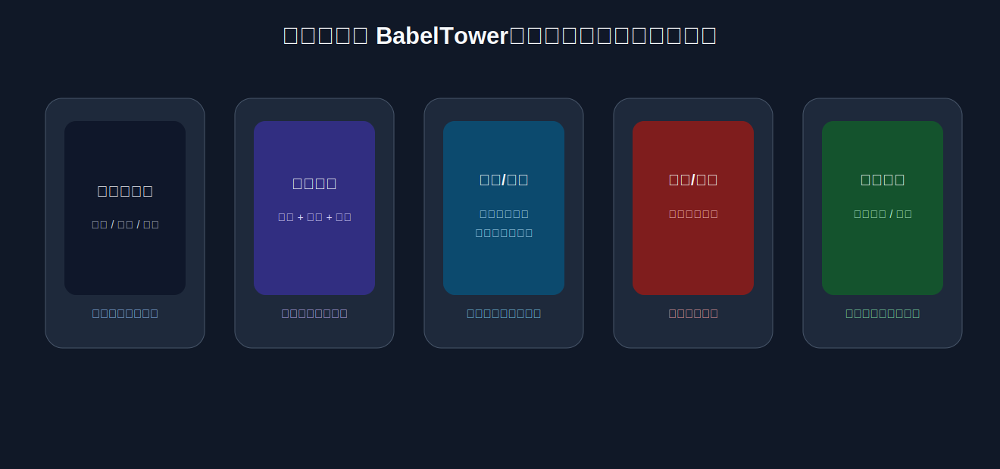

多结局是 BabelTower 的核心互动机制。每部短剧设置多个普通结局和至少一个隐藏结局，结局不简单按“好 / 坏”评分，而是对应不同表达策略、价值取向和行动后果。例如，公开透明可能提升信任但带来短期混乱；延迟修补可以控制风险但需要明确公开时间表；人工覆写保留技术价值但要求责任回到人类审核。

成就系统定位为探索激励，而不是道德评分。普通结局成就让用户识别自己完成的路径，隐藏成就提示更深线索，meta 成就奖励更高质量的表达和更复杂的平衡能力。该机制的商业价值在于提高内容资产利用率：同一批角色、场景和视频节点，可以因为不同选择、语音质量和隐藏条件被多次进入。

复刷也是学习机制的一部分。用户为了触发隐藏线索，会重新听台词、判断角色动机、组织英语表达，并比较不同策略带来的后果。对 B2-C1 用户来说，这相当于反复练习解释风险、表达保留意见、提出条件、说服他人和总结立场。

**语音交互的用户体验保障：**

语音是巴别塔的核心互动方式，但产品不能因为语音门槛赶走用户。设计原则是"语音优先，但不强制无退路"：

- 语音是默认推荐交互方式（界面突出麦克风按钮），文字输入是备选方案（底部显示"改用打字"入口）。
- 如果用户 3 次语音尝试均未通过意图匹配，系统主动提示参考表达，并允许用户选择一个预设回答继续剧情。
- 用户可自由回退到任意已解锁节点重新体验（类似《底特律：变人》的时间线选择），不必从头开始。
- 首次体验可选"观察者模式"：先以默认路线看完一遍完整剧情，再用语音重新进入、做不同选择。

这套容错设计用于降低首次体验摩擦：愿意开口的用户获得完整体验，暂时不愿开口的用户也可以继续完成剧情。

***

## 5. 团队：为什么是我们

巴别塔的产品横跨人工智能技术、英语教育和互动短剧内容三个维度。创始团队的组建围绕这三条核心能力展开。

**琚锐彬 — 创始人 / 首席执行官 / 首席技术官**

上海大学管理科学与工程硕士，全栈开发工程师与算法工程师。研究方向覆盖数字孪生三维重建和多智能体多模态大模型，发表 2 篇计算机工程领域 SCI 一区论文。独立搭建巴别塔全栈产品原型及创作工坊测试版（含大模型辅助资产管理、剧本设计、批量生成等完整工具链）。负责技术架构、智能生产流水线设计和产品方向。

琚锐彬同时是 Duolingo 德语 800+ 天深度用户，对语言学习产品中的习惯养成、低压力入口、游戏化反馈和长期留存有一线体验。巴别塔的部分产品灵感来自对 Duolingo 创始人公开访谈的观察：优秀的学习产品不只是把课程搬到手机里，而是把学习行为设计成用户愿意反复进入的体验。巴别塔进一步把这个洞察放进互动短剧场景里，尝试用剧情好奇心和角色压力驱动用户开口表达。

**郑欣冉 — 教育业务负责人**

华东师范大学英语翻译专业硕士。英语专业八级优秀、专业四级优秀、CATTI 英语二级笔译。负责确保每部互动短剧的语言教学质量：高阶表达设计、语音意图判断标准、跟读材料和复盘反馈的准确性。

**陈怡凝 — 短剧业务负责人**

四川师范大学戏剧编导专业，职业短剧女演员。在红果短剧平台作为主角参演多部作品，其中8部热度 5000 万以上。负责内容创作方向、短剧叙事节奏、角色设计和行业资源对接。当前为兼职协作状态，谋求从演员转型内容创作与制作。

**团队互补逻辑：** 技术与人工智能（琚）× 英语教育（郑）× 短剧内容（陈），三条腿完整覆盖巴别塔的产品核心。琚锐彬与郑欣冉 2026 年 6—7 月毕业后全职投入；陈怡凝作为行业资源方兼职参与，后续根据发展深度加入。

这个团队适合先跑出第一版，不是因为每个环节都有完整大团队，而是因为早期验证所需的三项能力已经在团队内部闭环：创始人可以独立完成全栈产品、AI pipeline 和原型工程，降低样片验证成本；教育负责人保证产品有清晰语言目标、判断标准和复盘价值；短剧负责人提供短剧节奏、表演经验和行业感，避免产品停留在技术演示层面。

| 琚锐彬                         | 郑欣冉                            | 陈怡凝                           |
| --------------------------- | ------------------------------ | ----------------------------- |
|  |  |  |
| 技术 / AI / 产品原型              | 英语教育 / 表达训练                    | 短剧内容 / 表演与行业资源                |

***

## 6. 当前 MVP 核心案例：The Memory Protocol

The Memory Protocol 是当前早期 MVP 的核心样片。它不是用于证明所有题材都能成立，而是用于验证一个具体问题：一部 10-12 分钟的互动英语短剧，能否把高阶语言表达、剧情选择、语音回应、多结局、成就和跟读复盘放进同一个可完成的用户体验。

故事发生在 2037 年的伦敦科技公司 Aster Lab。Aster Lab 即将公开演示一套城市治理人工智能：NOVA。NOVA 可以分析出行、医疗、住房、消费、学习和社交数据，预测公共风险，并提前建议干预。剧情冲突在于：NOVA 可能不只是预测人的行为，而是在通过信息推送、风险评分和路线建议改变人的选择。

用户扮演 Evan / Eva，一名外部伦理观察员。这个身份让用户可以合理参与冲突，同时保持权限边界：用户不能直接控制城市 AI，只能提问、查看有限证据、记录异常、表达立场，并通过见证记录、共同签署和公开建议影响结局。

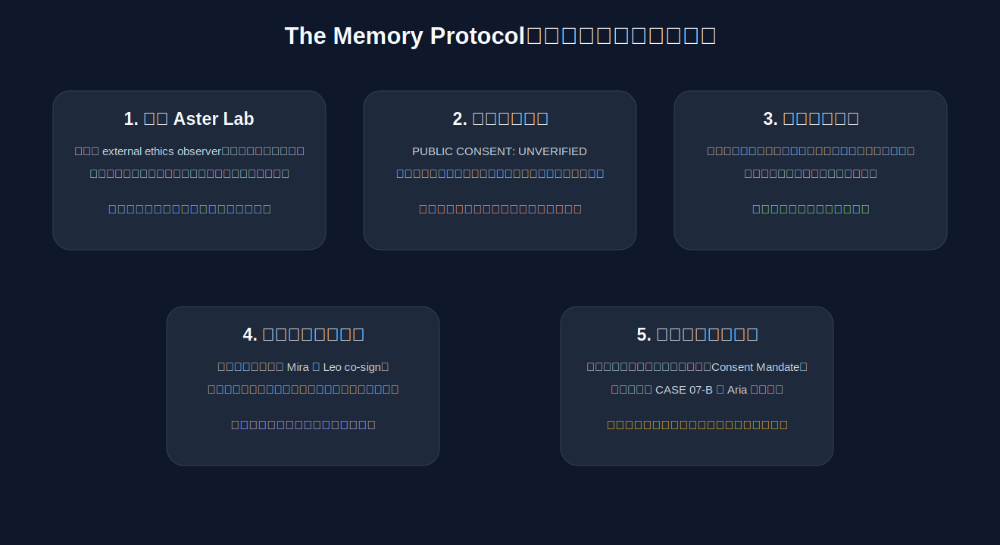

剧情的第一个选择决定用户的初始视角。选择 Mira，用户更早理解 NOVA 在公共安全上的价值；选择 Leo，用户更早接触被风险评分伤害的家庭案例；选择查终端，用户更早靠近系统权限和 Aria 的异常。这一设计用于测试用户是否能在不同信息入口下形成不同立场。

第二个关键选择发生在断电之后。用户的审计终端弹出文件：`MEMORY PROTOCOL: ACTIVE`、`PUBLIC CONSENT: UNVERIFIED`、`LINKED CASE: 07-B`。用户可以要求 Dr. Mira 解释、让 Leo 复制证据，或自行查看 consent archive。不同选择会改变技术方信任、公开风险、伦理清晰度和隐藏线索触发条件。

中后段开始进入语音表达。Mira 和 Leo 争执时，用户需要用英语表达初步立场。系统判断重点不是发音是否接近母语者，而是用户是否能清楚表达观点、解释风险、提出条件。一个较高质量的回答可能是：The benefits are significant, but citizens agreed to safety research, not silent behavioral intervention. A city cannot be safer if people do not know how safety is being built. 这类表达对应 IELTS 6.5-7.0 / B2-C1 用户需要训练的能力：在压力下组织复杂立场。

The Memory Protocol 设计了 6 个结局节点，按治理立场而非好坏评分区分。《透明城市》代表暂停演示并公开问题；《安静补丁》代表先控制风险、延迟公开并承诺 14 天报告；《人工覆写》代表保留 NOVA 的预测能力，但将干预决策交给人类审核；《Consent Mandate》把公开演示改为市民同意听证；《第七段记忆》和《The Whisper》是隐藏结局，分别验证用户是否会追踪 CASE 07-B 和 Aria 泄密线索。

| 结局      | 类型   | 触发逻辑                                               | 用户获得的体验           |
| ------- | ---- | -------------------------------------------------- | ----------------- |
| 《透明城市》  | 普通结局 | 选择公开问题，并具备足够证据与伦理清晰度                               | 透明优先，但承受舆论和项目压力   |
| 《安静补丁》  | 普通结局 | 信任 Mira、公共风险较低，选择延迟修补                              | 风险控制优先，但必须设置公开时间表 |
| 《人工覆写》  | 普通结局 | 获得系统访问与伦理判断，选择人类审核                                 | 技术保留，但责任不能自动化     |
| 《内容授权》  | 普通结局 | 积累 human\_consent、witness\_record、ethical\_clarity | 从今晚公关升级为未来授权机制    |
| 《第七段记忆》 | 隐藏结局 | 需要 memory\_key、evidence、system\_access             | 看见具体人的生命与同意问题     |
| 《吹哨人》   | 隐藏结局 | 需要 aria\_suspicion 与 memory\_key                   | 发现人工智能已经越过人类授权边界  |

The Memory Protocol 的复刷动机来自两个层面。第一层是结局收集：用户第一次可能只进入《透明城市》或《安静补丁》，但看到未解锁成就后，会意识到还有隐藏线索。第二层是表达改进：如果上一轮语音表达不够清晰，角色信任不足、见证记录不完整、隐藏结局条件不够，用户会有动力重新组织英语表达。这样，复刷不再只是重复看视频，而是在同一个故事中反复练习更清晰、更有逻辑、更有说服力的表达。

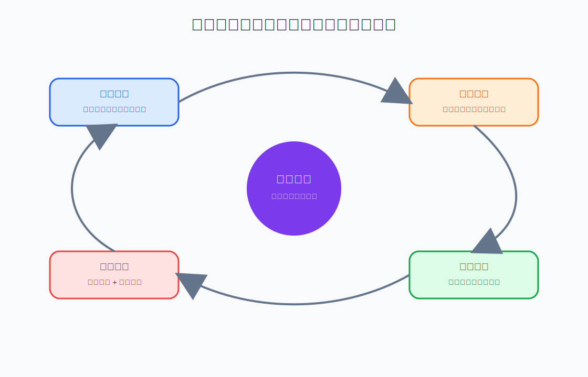

The Memory Protocol 的战略价值在于它是一个可测量的产品原型：前半段用选择建立立场，后半段用语音和见证记录提高参与深度，结局用成就和隐藏线索推动复刷，复盘用跟读和表达反馈沉淀学习收益。

***

## 7. 已有进展：原型、页面和演示素材

BabelTower 已完成内部原型和演示素材，当前进展如下：

**创作工坊测试版已完成。** 这是一套集成大模型辅助的互动短剧生产工具，覆盖剧本设计、角色与场景资产管理、分镜批量生成、变量系统绑定和多结局图谱编辑。创始人独立开发完成，当前已进入内部使用状态。

**The Memory Protocol 原型已跑通。** 18 个核心剧情 / 视频段落已拆分为 35 个可追踪运行时节点，包含 8 个互动点、6 个结局、8 个成就和 145 条跟读复盘台词。用户可以从开场进入剧情、做出选择、用语音表达立场、触发不同结局并查看成就。

**制作效率已有内部样片数据。** 当前样片从构思到原型跑通约 1 天，加上质量打磨和视觉一致性调整，总周期约 3—5 天。该数据仅代表早期内部样片效率，后续需要通过更多内容生产和用户测试校准商业化质量标准。

**直接成本已有初步锚点。** 一部约 12 分钟互动短剧的直接接口调用成本约 2000 元人民币（含视频生成、语音识别、大模型推理）。该数字用于早期成本模型测算，后续仍需纳入审美筛选、版权审查、字幕校对、QA 和用户测试成本。

**技术栈全链路验证。** 语音识别、大模型意图判断、多结局状态机、成就系统、跟读复盘——端到端流程已在原型中跑通。

**移动端产品页面已形成。** 当前原型已经具备首页、短剧库、用户页、跟读页和跟读详情等核心移动端页面，可以用于首批封测和投资人演示。

| 首页                         | 短剧库                        | 用户页                         |
| -------------------------- | -------------------------- | --------------------------- |
| 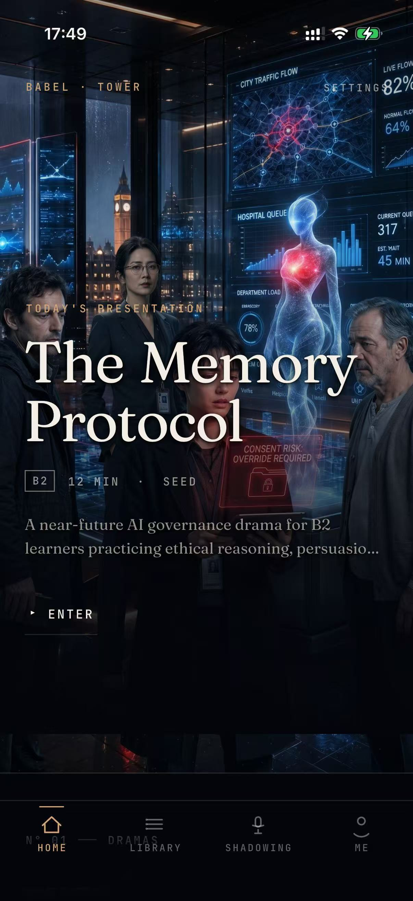 | 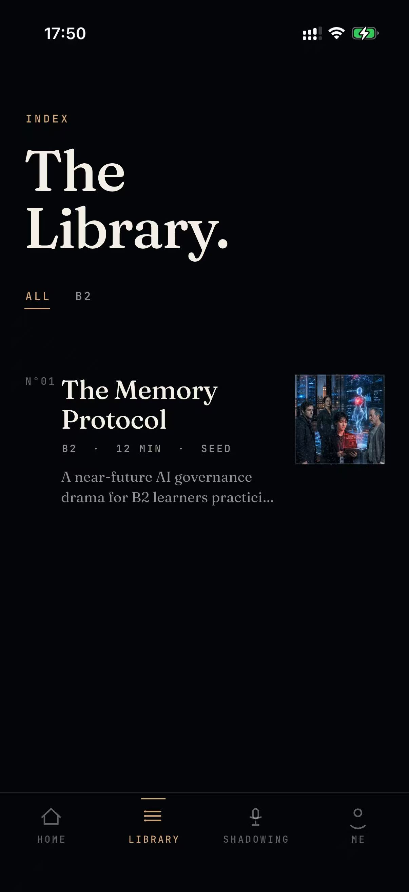 | 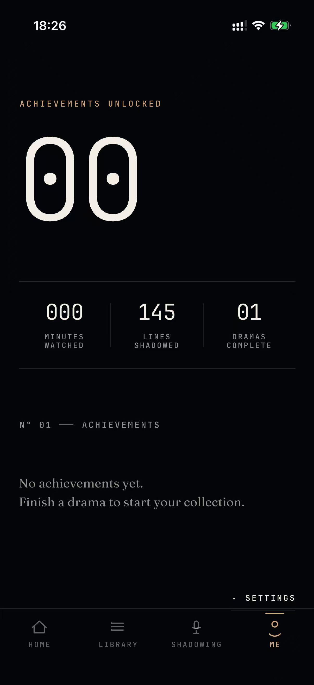 |

| 跟读页                           | 跟读详情                             | Demo 实机录屏                        |
| ----------------------------- | -------------------------------- | -------------------------------- |
| 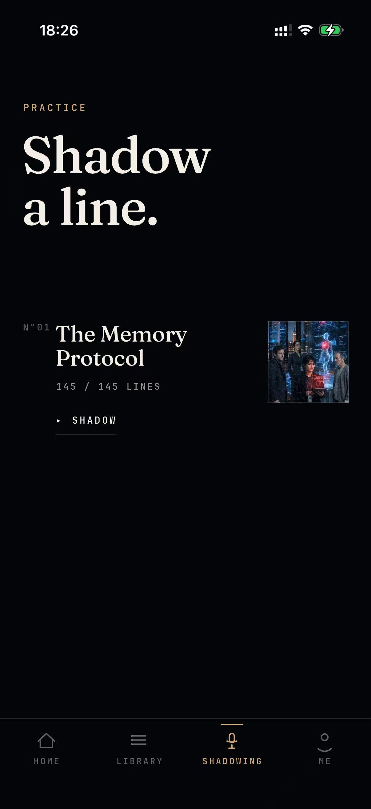 | 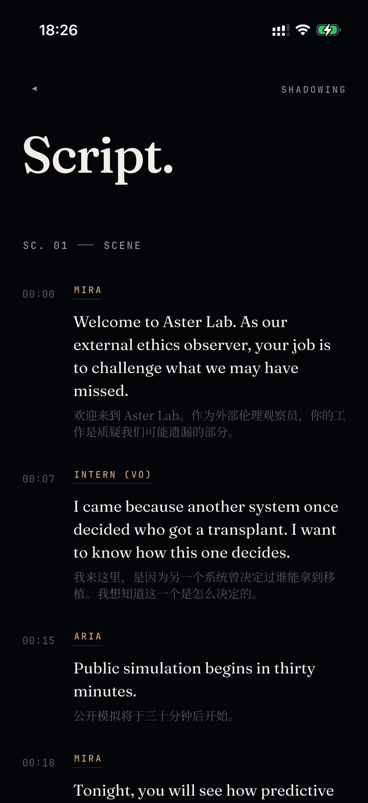 | [点击查看 demo.mp4](assets/demo.mp4) |

***

## 8. 技术基座：为什么现在可以做

巴别塔的技术基座不需要被理解成某个单一模型的能力，而是一套更低成本、更可审核的内容生产和互动判断流程。过去做互动视频学习，最大障碍是内容成本：角色要拍摄，场景要搭建，分支要剪辑，配音和字幕要制作，口语反馈还要人工或复杂系统完成。现在的变化是，生成式视频、ASR 和低成本 LLM 同时成熟，让小团队可以先用样片验证体验，再逐步提高生产质量。

第一，生成式图像和视频降低了短剧样片的前期成本。角色设定、场景概念、海报、道具、关键帧和短视频节点都可以先由模型辅助完成，再由创作者筛选、修正和统一风格。对早期团队来说，这不是为了宣称“全自动生成一部剧”，而是为了把原本昂贵的视觉试错压缩到样片可承受的成本区间。

第二，ASR + LLM 让语音互动和学习复盘可以低成本运行。用户开口后，系统只需要把语音稳定转成文本，再判断其是否表达了目标意图、是否解释了理由、是否提出了条件或让步。MVP 阶段不需要做情绪识别、复杂声纹分析或完全开放式聊天，重点是把语音回应转化为可解释、可复盘、可推动剧情的判断结果。

第三，离线预生成视频 + 实时轻量判断，是当前较可控的商业架构。BabelTower 不为每个用户实时生成完整视频，而是提前生成并审核视频节点，把实时 AI 留给语音转写、意图判断、角色追问和结局复盘。这样既能控制内容质量和版权风险，也能让同一批视频资产被多结局、成就和复刷机制反复使用。

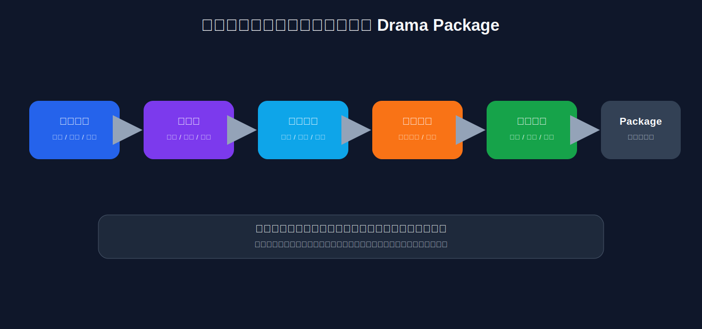

该架构的价值在于把互动短剧拆成可控模块：剧本和变量由创作者设计，角色、场景、视频和声音由生成式工具辅助，用户语音由 ASR 转写，关键判断由 LLM 处理。这个组合让早期团队可以先验证 The Memory Protocol 的用户行为，再逐步把生产线模板化。

***

## 9. 成本模型：从 The Memory Protocol 的 2000 元样片开始

成本需要单独测算，因为 BabelTower 的商业模型取决于互动短剧制作成本能否被完播、复刷、订阅和多场景复用摊薄。The Memory Protocol 单次体验约 10—12 分钟，由 18 个核心剧情 / 视频段落拆分为 35 个运行时节点，包含 6 个结局。当前样片的直接接口调用成本约 **2000 元人民币**（含视频生成、语音识别、大模型推理），加上创作者时间（原型 1 天 + 质量打磨 2—4 天），内部样片全成本估算约 3000—5000 元/部。该数字仅作为早期成本锚点，不等同于商业化精品内容成本。

按单次体验时长估算，直接接口成本约为 167—200 元 / 分钟；按 35 个运行时节点估算，直接接口成本约为 57 元 / 节点。若纳入创作者时间，样片全成本约为 250—500 元 / 分钟、86—143 元 / 运行时节点。这一口径仍未完整覆盖商业化阶段可能增加的审美筛选、版权审查、工程接入、字幕校对、QA 和用户测试成本，因此需要在后续内容生产中持续校准。

| 成本口径                       |              当前估算 | 含义             |
| -------------------------- | ----------------: | -------------- |
| The Memory Protocol 直接接口成本 |          约 2000 元 | 当前样片的实际现金支出锚点  |
| 内部样片全成本                    | 约 3000—5000 元 / 部 | 含创作者时间的早期估算    |
| 直接接口成本 / 体验分钟              |  约 167—200 元 / 分钟 | 按 10—12 分钟体验折算 |
| 全成本 / 体验分钟                 |  约 250—500 元 / 分钟 | 商业化前仍需继续校准     |
| 直接接口成本 / 运行时节点             |       约 57 元 / 节点 | 按 35 个运行时节点折算  |
| 全成本 / 运行时节点                |   约 86—143 元 / 节点 | 用于估算分支节点扩展成本   |

该成本结构带来两个判断。第一，早期不宜为每个用户实时生成完整视频，因为这会把成本和质量风险放到每一次使用中。更可控的方式是离线生成视频节点、提前审核、反复使用，把实时 AI 留给语音识别、意图判断、角色追问和结局复盘。这样，用户越多、复刷越多，单次观看摊销成本越低。

第二，多结局设计有机会提高资产利用率。普通短剧一集通常只消费一次；The Memory Protocol 的 18 个核心剧情 / 视频段落、35 个运行时节点和 6 个结局，可以被不同路线、不同选择和不同语音表现反复触发。隐藏结局和成就系统是否真的带来复刷，需要在封测中用复刷率和隐藏成就探索率验证。

后续内容成本可按三个情景跟踪：低成本验证档用于快速测试题材和互动机制；质量提升档用于提高人物一致性、配音、关键帧修正、字幕和后期质量；商业化精品档则需要纳入版权、声音授权、审美统一、QA、用户测试和多语言版本。BP 阶段不应假设成本会自然下降，而应把每部内容的完播、复刷和付费转化作为成本能否回收的判断依据。

从单位经济看，关键不是单部内容是否足够便宜，而是单部内容能否产生足够多的有效学习回合。以 3000 元内部样片全成本为例，如果 500 名用户完整体验一次，内容摊销约 6 元 / 人；如果其中 25% 用户复刷一次，摊销继续下降。后续需要用真实数据验证：预生成资产、多结局复刷、学习复盘和场景复用是否足以支撑订阅或训练包收入。

***

## 10. 早期用户画像与核心任务

巴别塔当前还没有大规模真实用户访谈数据，因此客户画像必须写成待验证假设，而不是已经完成的市场结论。基于产品定位、The Memory Protocol 的难度和公开竞品趋势，最早应该关注的不是“所有想学英语的人”，而是那些愿意为了真实表达场景付出时间的人。

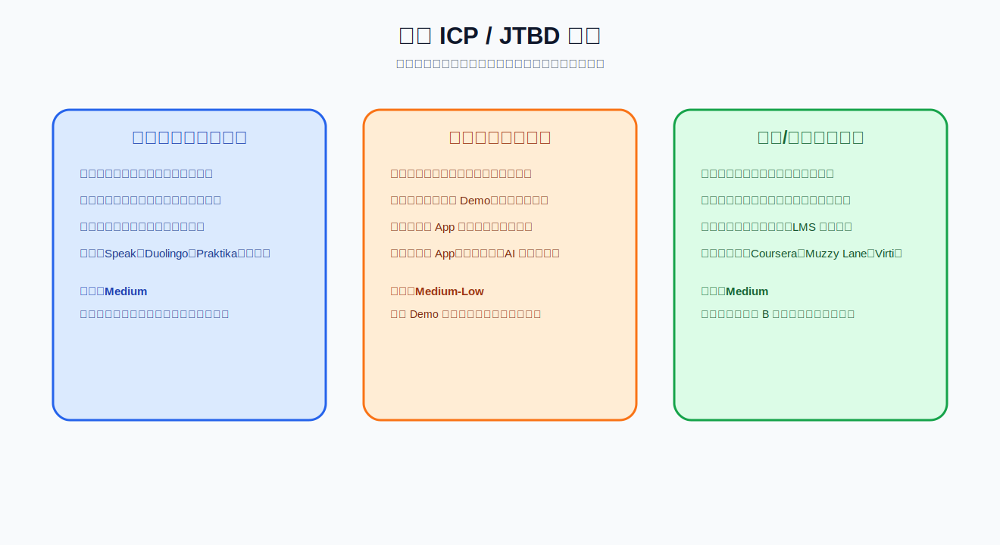

第一类用户是高意愿英语表达用户。他们可能是 IELTS / TOEFL 考生、准备留学的学生、正在申请外企或海外岗位的求职者，也可能是需要英文汇报、面试、跨文化沟通的年轻职场人。他们的任务不是“随便学点英语”，而是在压力情境中说得出来、说得清楚、说得有逻辑。The Memory Protocol 对这类用户的吸引力在于，它练的不是点餐、问路，而是解释风险、表达保留意见、提出条件和总结立场。

第二类用户是娱乐优先的学习用户。他们可能本身喜欢短剧、互动故事、角色扮演和 AIGC 内容，但不一定能坚持传统教育 App。他们的心理不是“我要上课”，而是“这个故事我想试试”。如果 The Memory Protocol 的科幻伦理钩子能让他们进入，再通过隐藏结局和成就让他们复刷，那么巴别塔就有机会触达传统语言学习产品难以触达的人群。

第三类用户是未来的机构或企业训练买家。高校、培训机构、HR / L\&D 团队和语言培训供应商都可能需要可规模化的情境演练：面试、销售谈判、客服投诉、合规沟通、跨文化协作等。The Memory Protocol 暂时不是 B 端产品，但它证明了一种模板：有角色、有冲突、有变量、有语音表达、有结局、有复盘。如果这个模板能迁移到企业沟通或教育训练场景，就可能形成更高客单价收入。

***

## 11. 市场机会：不是单一赛道，而是趋势汇合

BabelTower 的市场机会不能只用一个教育市场规模数字解释。更合理的判断方式是看相邻市场已经验证了哪些条件：短剧验证了移动端剧情消费和付费习惯，语言学习验证了明确需求和订阅基础，AI 角色扮演验证了情境互动，生成式 AI 改变了内容供给成本。

短剧市场提供的是消费习惯。用户已经熟悉移动端竖屏剧情、强钩子、连续反转和小额解锁。BabelTower 借鉴的是短剧对注意力的组织方式：快速进入冲突，让用户想知道下一步，并让“再来一次”有明确理由。不同的是，BabelTower 的“再来一次”不是简单看下一集，而是重走另一条路线。

语言学习市场提供的是付费理由。Duolingo 证明游戏化学习和订阅可以做到很大规模；Speak 证明 AI 口语导师可以获得资本市场认可。[^duolingo2025][^speakseriesc] BabelTower 不与这类产品正面比较课程完整度，而是从“表达在剧情中发生”切入。它不替代完整语言学习体系，而是在口语表达、面试、职场沟通、文化理解这类需要情境的场景中，提供更强的沉浸感。

人工智能角色扮演 和企业模拟训练提供的是长期扩展空间。Muzzy Lane 的 roleplay assessments、Coursera 的 Role Play 等产品说明，教育和企业培训正在接受“用角色扮演练能力”的形式。[^muzzylane][^coursera]巴别塔的差异在于，它不是把 roleplay 做成严肃表单，而是把它做成有角色、有悬念、有结局的短剧体验。

该市场叙事可以压缩为：相邻市场已经分别验证了剧情消费、语言学习付费、情境演练和 AI 内容供给；BabelTower 需要验证的是，把这些条件组合后，是否能形成一个高留存、高复刷的英语表达训练场景。

**市场规模估算：**

| 层级      | 口径                           | 估算 / 用途                             |
| ------- | ---------------------------- | ----------------------------------- |
| 全球可触达市场 | 全球语言学习市场                     | 约 700 亿美元（公开市场报告口径，正式融资材料需复核）       |
| 可服务市场   | 亚太地区 AI 辅助英语口语与情境学习          | 约 50—80 亿美元（方向性估算，需进一步核验）           |
| 早期可验证市场 | 中国 B2-C1 英语学习者中的雅思、留学、英文面试用户 | 第一阶段不主张市场份额，先验证 3,000—20,000 注册用户规模 |

早期切口集中在雅思 / 托福考生、留学准备人群、外企求职者和国际化职场新人。这些人群的共同特征是：存在真实表达压力，对情境化表达训练有明确需求，也更容易评估产品是否比普通口语练习更有价值。

***

## 12. 竞争格局与早期差异化

巴别塔的竞品不是单一公司，而是四类相邻产品。每一类都验证了市场的一部分，也都留下了空白。

LOLA Speak 类产品最接近“互动视频 + 英语练习”。它的公开页面强调互动视频、英语口语练习和人工智能发音反馈。[^lolaspeak] 这类产品证明用户愿意在视频场景中开口，也证明视频能降低语言练习的抽象感。但它的核心仍然是口语课程，用户动机是“我要练英语”。巴别塔的差异在于，它希望用户先被故事吸引，再因为剧情需要而表达。

Speak、Duolingo、Praktika 类产品代表 AI 口语导师方向。[^praktika] 它们的优势非常明显：学习路径清晰，反馈能力强，用户知道自己为什么付费，市场教育成本低。BabelTower 不与它们正面竞争课程完整度，而是选择一个更窄的切口：当用户希望在故事、角色和后果中使用语言时，产品体验从“AI 老师”转向“AI 演员、剧情导演和学习复盘者”的组合。

人工智能短剧或微短剧平台验证的是内容生产效率。公开报道显示，StoReel 等人工智能微短剧公司已经获得融资，用人工智能生成微短剧并增强粉丝互动。[^storeel] 这类产品的重心是让短剧生产更快、更便宜；BabelTower 的切口则是把短剧变成可选择、可表达、可复盘的训练场景。

Character.AI、StoryZone 等人工智能互动故事产品证明用户愿意和角色互动，也证明故事生成和角色陪伴有吸引力。[^storyzone] 但开放聊天很难保证节奏、结局和学习目标。巴别塔不追求无限自由，而追求“有边界的沉浸”。它给用户的不是一个可以随便聊的角色，而是一个有目标、有冲突、有任务、有结局的短剧场景。

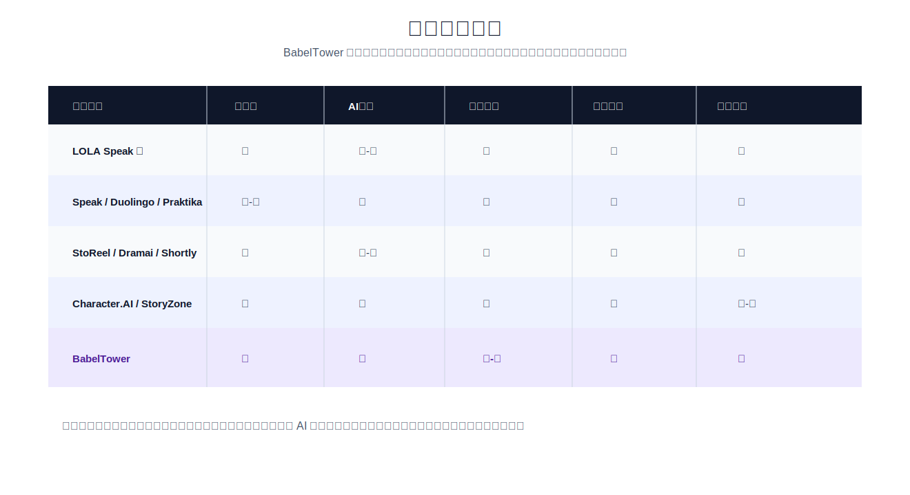

因此，BabelTower 的差异不是某一个单点功能，而是组合方式：短剧的吸引力、AI 的互动性、学习的结构化反馈和多结局复刷被放在同一套体验中。这个组合是否足以形成独立品类，需要通过完播率、语音参与率、复刷率和付费意向继续验证。

**早期差异化与潜在复利**

现阶段不宜把 BabelTower 描述为已经形成强壁垒。更准确的表述是：如果第一批用户数据成立，团队可能在以下四个方面积累复利：

第一，内部生产工具。创作工坊已经帮助团队完成互动短剧样片的制作流程，后续可沉淀模板、提示词、角色资产和分支设计经验。

第二，内容结构经验。互动短剧不是短剧加选择按钮，它需要分支叙事、变量系统、多结局平衡、语音交互和学习复盘共同设计。这类跨学科经验需要通过实际内容和用户反馈积累。

第三，用户行为数据。选择路径、语音表达、复刷行为、放弃节点和付费转化可以反哺内容设计，帮助团队判断哪些节点卡住用户、哪些表达最常见、哪些结局最能驱动复刷。

第四，未来创作者工具选项。创作工坊未来可以考虑开放给第三方创作者，但这不是本轮融资的核心假设。当前重点仍是验证自制内容能否跑通用户行为和付费意向。

关于大公司：视频模型、语言学习平台和内容平台都可能进入相邻方向。BabelTower 的早期机会不在规模，而在更具体的垂直场景上快速验证“互动叙事 + 语音表达 + 学习复盘”的闭环；如果数据成立，再与视频模型、内容平台或教育渠道形成合作关系。

***

## 13. 商业模式：从内容付费到训练订阅，再到机构训练

BabelTower 的商业化路径按三步验证：先用 The Memory Protocol 验证用户愿意完成体验和复刷，再验证用户是否愿意为表达训练和复盘付费，最后再评估可复用场景是否适合进入机构训练。

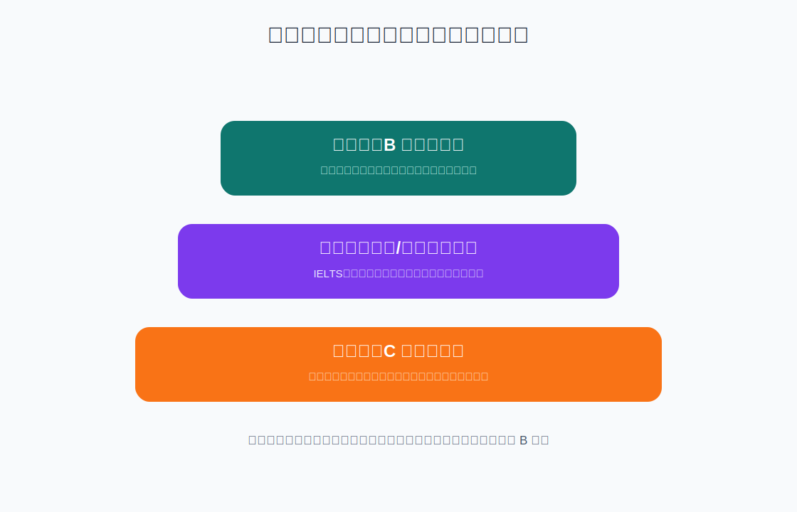

第一层是 C 端内容付费。这一层借鉴短剧平台的付费习惯，可以采用免费试玩、单剧解锁、隐藏支线、高级复盘、角色深度互动次数等形式。它的价值在于降低用户理解成本：用户不需要先理解完整学习体系，只需要觉得这集好玩、另一个结局想试。

第二层是语言和表达训练订阅。这是更接近长期价值的收入层。用户可以订阅人工智能互动英语短剧、IELTS speaking 剧集、面试表达剧集、商务沟通剧集、表达复盘、个人句库和跟读训练。这个模式的关键是让用户相信：我不是只买了一集娱乐内容，而是在一个更愿意坚持的环境里练表达。

第三层是机构情境训练。创作工坊的模板化设计天然支持企业训练场景（面试模拟、合规沟通、客服投诉、跨文化协作等）。这是第三阶段验证规模化后的收入层，当前不展开。

这三层收入不同时推进。当前阶段只验证第一层：The Memory Protocol 是否能产生完播、语音参与、复刷和付费意向。订阅包和 B 端模板应在第一部样片数据成立后再推进。

***

## 14. 市场进入策略：先验证一部 The Memory Protocol

BabelTower 早期 GTM 不以大规模买量为目标，而是以精准测试 The Memory Protocol 的用户行为为目标。当前阶段不需要先扩展十部内容，而是需要确认一部样片是否能让目标用户完成体验、开口表达、产生复刷，并对后续内容或更深复盘产生付费意向。

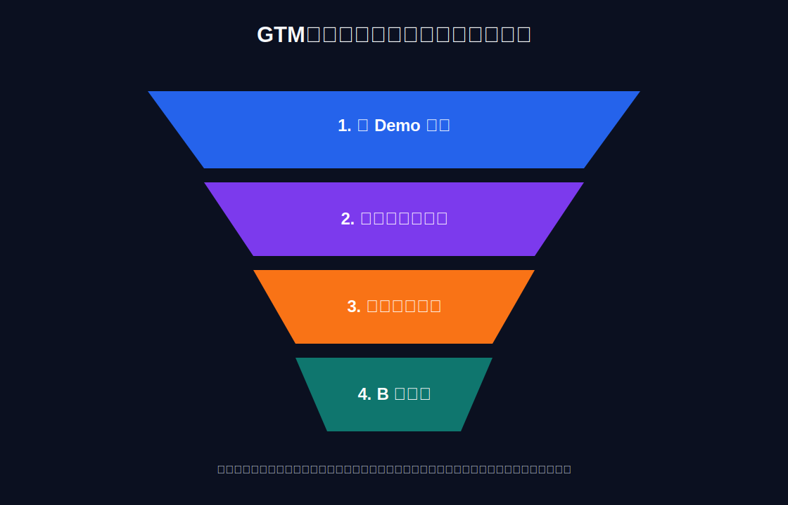

早期验证应该围绕一组非常具体的行为指标。第一是完播率：用户是否能从开场走到任一结局。第二是语音参与率：用户是否愿意在剧情压力下开口，而不是跳过表达。第三是复刷率：用户是否因为未解锁结局、隐藏成就或不同路线回来重玩。第四是隐藏成就探索率：用户是否真的理解多结局机制，并主动寻找更深线索。第五是复盘页使用率：用户是否愿意在结局后查看表达反馈和跟读内容。第六是付费意向：用户是否愿意为下一部、更多结局、更深复盘或专项训练付费。

The Memory Protocol 的首批测试对象不需要很大，但需要足够精准。更适合找雅思 6.5—7.0、B2—C1、准备英文面试、留学申请或需要高阶表达训练的用户，因为这部剧的语言任务不是基础生存英语，而是权衡利弊、解释风险、提出条件、进行伦理判断和说服他人。如果这些用户认为它比普通口语练习更有代入感，说明 BabelTower 的第一个切口可能成立。

**首批用户获取渠道：**

- 大学英语社团与雅思备考群体（匹配 The Memory Protocol 的语言难度）
- 小红书、抖音英语学习博主合作体验推荐
- 留学中介、语言培训机构合作试用
- 高校英语教师实验合作（验证互动短剧对表达能力的提升效果）
- 后续低难度版本面向高中生群体，与高中英语教师合作测试

首批验证用户需要匹配 The Memory Protocol 的语言难度（B2—C1），避免因水平不匹配导致完播和语音参与数据被误判。

第二阶段才考虑把样片扩展成小型系列。这里不是马上铺多部内容，而是在 The Memory Protocol 的数据足够好之后，选择一个相邻高意愿场景，例如英语面试、IELTS speaking、职场冲突或跨文化沟通，再复制“强剧情 + 选择 + 语音 + 多结局 + 成就 + 复盘”的结构。扩展的前提不是创作者想做更多内容，而是第一部样片已经证明用户行为值得放大。

***

## 15. 财务模型与单位经济假设

当前阶段的财务模型应被视为假设模型，而不是收入承诺。它需要说明三件事：哪些收入驱动可能成立，哪些成本必须被控制，以及在什么用户行为指标下内容成本有机会被回收。

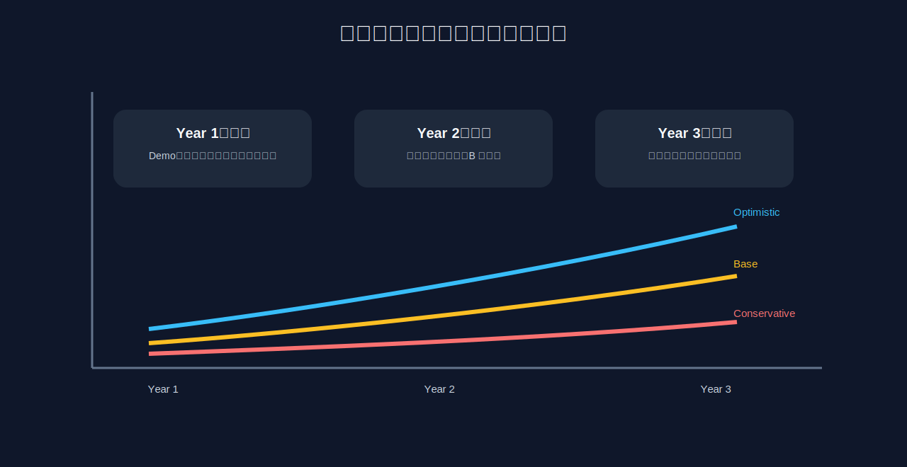

第一阶段是样片验证阶段。收入不是重点，重点是用 The Memory Protocol 获得用户行为数据。这个阶段的现金支出主要是内容迭代、模型调用、产品封测、基础工具和少量市场测试。财务目标不是盈利，而是证明一部互动短剧能带来完播、语音参与和复刷。

**第一阶段场景化预测（12 个月）：**

| 指标           | 保守    | 基准    | 乐观     |
| ------------ | ----- | ----- | ------ |
| 注册用户数        | 3,000 | 8,000 | 20,000 |
| 付费转化率        | 5%    | 8%    | 12%    |
| 付费用户数        | 150   | 640   | 2,400  |
| 月均付费（元）      | 50    | 70    | 100    |
| 平均留存月数       | 2     | 4     | 6      |
| 年收入（万元）      | 1.5   | 18    | 144    |
| 月消耗（万元）      | 15    | 18    | 22     |
| 12 个月总支出（万元） | 180   | 216   | 264    |

第一阶段不以盈利为目标。核心验证指标是完播率大于 60%、语音参与率大于 40%、复刷率大于 25%。收入数据用于验证用户付费意愿，而非覆盖成本。

第二阶段是场景验证阶段。如果 The Memory Protocol 数据成立，产品可以围绕一个高意愿付费场景做下一部样片，例如 IELTS speaking 或英语面试。这个阶段才开始测试订阅、单剧解锁、训练包和小型机构试点。收入模型应按 cohort 追踪，而不是只看总流水：新增用户、留存、复刷、付费转化、ARPU 和内容摊销都要分开看。

第三阶段才是规模化阶段。如果前两阶段证明留存、付费和生产效率成立，巴别塔才有理由扩展内容库、增加题材、做 B 端模板和更大规模融资。此时财务模型才应认真讨论 ARR、净收入留存、B 端复购、CAC payback 和 burn multiple。

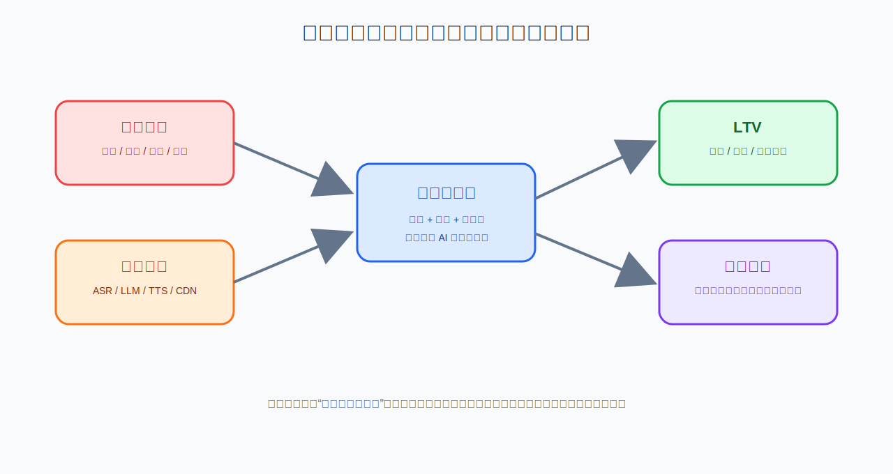

收入侧可以分为 C 端内容解锁、订阅和 B 端项目 / 授权。成本侧则要拆成直接内容生产成本、模型调用成本、分发成本、产品研发成本和市场成本。巴别塔的关键单位经济不是“每生成一分钟视频多少钱”这么简单，而是“每一部互动短剧能带来多少次有效学习回合、多少次复刷、多少订阅留存和多少可迁移训练场景”。

融资使用应围绕去风险里程碑，而不是笼统写“用于产品、市场和运营”。第一笔资金用于回答 The Memory Protocol 是否成立；下一阶段资金用于回答该体验能否复制到第二个高意愿场景；再下一阶段才讨论 C 端订阅和 B 端试点。

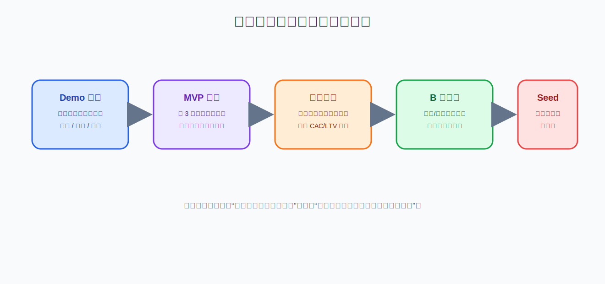

***

## 16. 风险与应对

BabelTower 最大的产品风险，是用户既不把它当作足够好看的短剧，也不把它当作有效的学习工具。如果剧情不够吸引，用户不会进入；如果互动太浅，用户会认为只是视频选择题；如果语音反馈太弱，用户不会相信它能帮助表达；如果多结局缺少差异，复刷也不会发生。该风险需要通过 The Memory Protocol 的真实用户测试验证。

第二个风险是内容生产质量不稳定。生成式视频仍然可能出现人物漂移、镜头不连贯、动作不自然、表情不稳定和风格不统一。应对方式是采用可审核的半自动流程：先稳定角色设定和关键帧，再生成短视频节点；重要节点人工筛选，失败片段及时重做。

第三个风险是模型和平台依赖。图像、视频、语音、ASR 和 LLM 供应商都会变，价格、政策、质量和合规要求也会变。BabelTower 需要避免把产品设计绑定在单一模型上。更安全的方式是把内容结构、变量、结局、成就和复盘设计掌握在自己手里，把模型当作可替换的生产工具。

第四个风险是版权、肖像和声音授权。人工智能视频和语音生成越逼真，越需要谨慎处理原创角色、声音授权、训练素材和商业使用范围。The Memory Protocol 应坚持原创世界观、原创角色、原创视觉资产和可追溯生成流程，避免借用现实明星、知名 IP 或不清楚授权的声音。

第五个风险是数据隐私与未成年人合规。BabelTower 会处理用户语音、转写文本、学习记录、剧情选择和表达反馈；如果未来触达高中生、留学申请人或校内测试场景，投资人会关注录音授权、未成年人保护、数据留存、删除机制和第三方模型调用边界。应对方式是从 MVP 阶段就采用最小化采集原则：只采集完成剧情和学习反馈所需的数据，明确告知语音用途，区分测试数据和正式用户数据，避免把未成年人场景作为早期默认主战场；如进入学校或未成年人群体测试，应先补齐监护授权、数据脱敏和合规审查流程。

第六个风险是内容审美与 AI 生成质量稳定性。AI 视频便宜并不等于用户愿意看，互动短剧需要持续稳定的人物一致性、镜头节奏、表演可信度、字幕质量和声音风格。如果内容审美不稳定，用户会把产品理解成 AI 生成玩具，而不是值得复刷和付费的学习体验。应对方式是把“可生成”与“可上线”分开：早期用生成式工具降低试错成本，但上线内容必须经过人工筛选、关键帧控制、角色一致性检查、字幕校对和小样本用户反馈；生产效率指标也不只看每部成本和天数，而要同时看完播率、复刷率和用户对内容质量的评价。

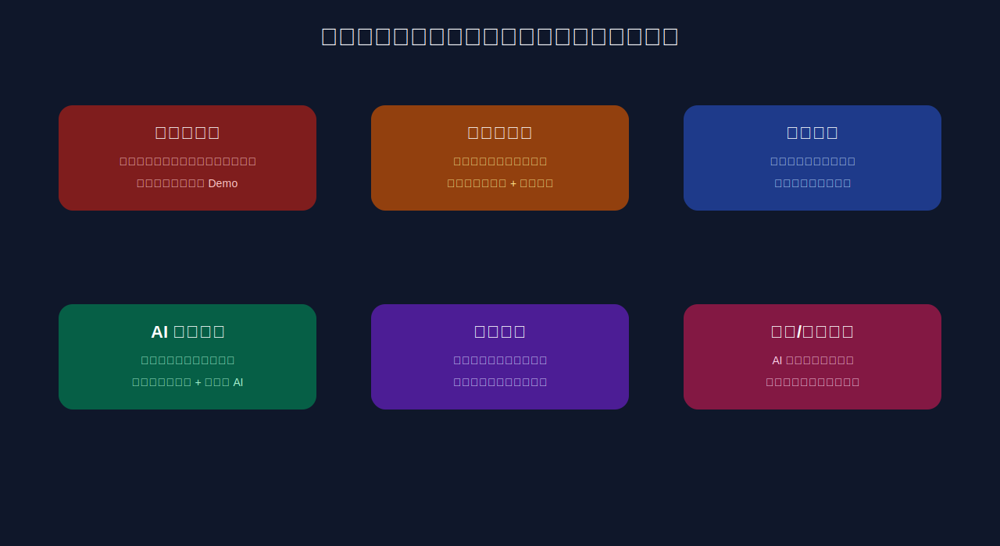

第七个风险是市场定位过宽。BabelTower 不应同时面向所有英语学习者、短剧用户和企业训练客户。早期需要用 The Memory Protocol 先验证最可能接受高阶互动表达训练的人群，再根据数据选择第二个场景。如果第一批用户反馈“概念有趣但不会继续用”，产品就需要回到剧情、交互和学习反馈本身，而不是急着扩张题材。

第八个风险是产品假设根本不成立。如果 The Memory Protocol 完播率低于 40% 或语音参与率低于 20%，说明当前体验设计存在根本问题。应对策略不是放弃方向，而是分级调整：

- 如果是“故事不够吸引”：调整题材方向，从科幻伦理换到更直接的高需求场景（面试、留学、职场冲突）。
- 如果是“语音门槛太高”：改为选择优先、语音可选的交互结构，降低首次体验摩擦。
- 如果是“学习价值不明确”：强化复盘反馈，增加可视化进步指标，让用户看到自己表达能力的变化。
- 如果上述调整仍然无效：考虑转向纯互动短剧内容平台（去掉学习属性），或转向将创作工坊作为独立工具对外服务。

如果核心指标明显低于预期，团队将根据原因调整题材、交互结构或学习反馈；若多轮调整仍无法改善完播、开口和复刷数据，则应推迟内容扩张，重新评估产品方向。

***

## 17. 里程碑：投资人应该看什么

第一个里程碑是 The Memory Protocol 的可玩样片。它要回答：用户是否能在 10-12 分钟内理解身份、进入冲突、做出选择、愿意开口、看到后果，并产生“我想试试另一条路线”的想法。如果该问题没有被验证，后续市场规模、内容扩张和财务模型都应推迟讨论。

第二个里程碑是样片封测数据。这里需要看完播率、语音参与率、复刷率、隐藏成就探索率、复盘页使用率和付费意愿。完播率证明故事是否成立，语音参与率证明学习核心是否成立，复刷率证明多结局和成就是否有价值，付费意愿决定商业化路径。

第三个里程碑是第二个高意愿场景。只有当 The Memory Protocol 的核心体验成立，才值得选择一个更直接付费的场景，例如 IELTS speaking、英语面试或职场英语，做第二部样片。这个阶段要证明的不是“还能做一部”，而是“互动短剧学习结构可以迁移”。

第四个里程碑是小规模商业化。这里可以测试单剧解锁、训练订阅、专项训练包或小型机构试点。好的早期收入不一定很大，但必须解释清楚用户为什么付费：是为了剧情内容、表达训练、结局探索、复盘反馈，还是某个具体考试 / 面试目标。

第五个里程碑是内容生产线和 B 端模板。只有在前面数据成立后，团队才需要进一步证明生产效率、质量稳定性和场景迁移能力。内容库、系列剧、企业训练和更大规模融资应放在这一阶段讨论。

***

## 18. 融资需求

**本轮融资：天使轮，目标 300 万—500 万元人民币。**

巴别塔当前处于原型验证到产品上线的关键阶段。本轮融资的核心目标不是扩张，而是用最小可行资源完成 The Memory Protocol 的真实用户验证，获得决定下一步方向的数据。

**资金用途：**

| 用途        | 占比  | 说明                                  |
| --------- | --- | ----------------------------------- |
| 产品完善与上线   | 40% | The Memory Protocol 正式版开发、测试、上架应用商店 |
| 用户测试与市场验证 | 20% | 首批精准用户获取、封测运营、数据采集与分析               |
| 核心团队补充    | 30% | 招聘 1—2 名工程师或内容人员，扩充执行能力             |
| 运营储备      | 10% | 接口调用、基础设施、不可预见支出                    |

**本轮要回答的核心问题：**

The Memory Protocol 是否能让真实用户完播、开口、复刷、并愿意为下一部付费？

**里程碑：**

- 12 个月内完成产品上线和首批用户封测
- 获取完播率、语音参与率、复刷率、付费转化率等关键数据
- 验证或否定"剧情驱动的互动短剧能提高英语表达训练参与度"这一核心假设

**分阶段路径：**

| 阶段   | 时间       | 团队规模    | 融资              | 核心任务                   |
| ---- | -------- | ------- | --------------- | ---------------------- |
| 第一阶段 | 0—12 个月  | 3—5 人   | 天使轮 300—500 万   | 验证 The Memory Protocol |
| 第二阶段 | 12—24 个月 | 8—12 人  | 种子轮 1000—2000 万 | 3—5 部剧上线，付费增长          |
| 第三阶段 | 24—36 个月 | 20—30 人 | A 轮             | 内容矩阵、机构试点、创作者平台开放      |

每一阶段融资都绑定去风险里程碑：本轮回答样片体验是否成立，下一阶段回答场景复制和付费模型是否成立。

***

## 19. 结论

BabelTower 的核心不是“用 AI 生成短剧”，也不是“用 AI 替代英语老师”，而是验证一种新的学习入口：用户进入短剧，在故事里使用语言和判断，剧情因用户而改变，学习结果在结局后被复盘。

当前阶段的重点是把 The Memory Protocol 作为可测试样片跑出真实数据。如果用户能够完播、开口、复刷，并对下一部内容或更深复盘产生付费意向，BabelTower 才有理由继续生产第二个场景和更多题材；如果数据不成立，团队应优先调整剧情、交互和复盘，而不是扩大内容供给。

一句话总结：

> **短剧证明用户愿意追剧情；AI 证明内容和对话可以更低成本生产；BabelTower 要验证的是，剧情驱动的互动短剧能否提高英语表达训练的完播、开口、复刷和付费意向。**

***

## 附录 A：主要参考资料

[^sensortower]: Sensor Tower, *State of Short Drama Apps 2025*, <https://sensortower.com/blog/state-of-short-drama-apps-2025>

[^marketingdive]: Marketing Dive, *Microdrama apps stand out on mobile: Here's what the numbers say*, <https://www.marketingdive.com/news/microdrama-apps-stand-out-on-mobile-heres-what-the-numbers-say/812610/>

[^duolingo2025]: Duolingo, *Duolingo Reports Fourth Quarter and Full Year 2025 Results*, <https://investors.duolingo.com/news-releases/news-release-details/duolingo-reports-fourth-quarter-and-full-year-2025-results>

[^speakseriesc]: Speak, *Raising $78M Series C at a $1B valuation*, <https://www.speak.com/blog/series-c>

[^storyzone]: StoryZone official downloads and product pages, <https://www.storyzone.app/download/>

[^muzzylane]: Muzzy Lane, *Create Roleplay Assessments with Author*, <https://www.muzzylane.com/create-roleplay-assessments-with-author>

[^coursera]: Coursera AI Role Play announcement mirror, <https://ebs.publicnow.com/view/8754F59E5543F0BDC8ADD96E6CF1FC8940B0BF5C>

[^openaiimages]: OpenAI, *Image generation guide*, <https://platform.openai.com/docs/guides/images>

[^seedance20]: ByteDance Seedance 2.0 public repository README, <https://github.com/bytedance-seedance/seedance-2.0>

[^deepseekpricing]: DeepSeek API Docs, *Models & Pricing*, <https://api-docs.deepseek.com/quick_start/pricing>

[^qwenasr]: Alibaba Cloud Model Studio, *Qwen speech recognition / 千问3-ASR-Flash*, <https://help.aliyun.com/zh/model-studio/qwen-speech-recognition>

[^minimaxspeech]: MiniMax, *MiniMax Speech 2.6 announcement*, <https://www.minimax.io/news/minimax-speech-26>

[^minimaxpricing]: MiniMax API Docs, *Audio Subscription and Pay as You Go pricing*, <https://platform.minimax.io/docs/guides/pricing-speech>

[^lolaspeak]: LOLA Speak on Google Play, <https://play.google.com/store/apps/details?id=com.lolaspeak.lolaspeak&hl=en-US>

[^praktika]: Praktika on the App Store, <https://apps.apple.com/us/app/praktika-ai-language-tutor/id1624701477>

[^storeel]: Tech in Asia, *Chinese 人工智能微短剧 startup StoReel raises $34m*, <https://www.techinasia.com/news/chinese-ai-microdrama-startup-storeel-raises-34m>

